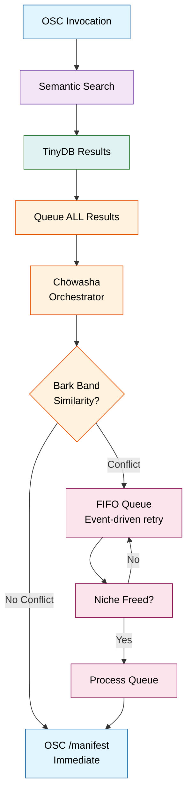
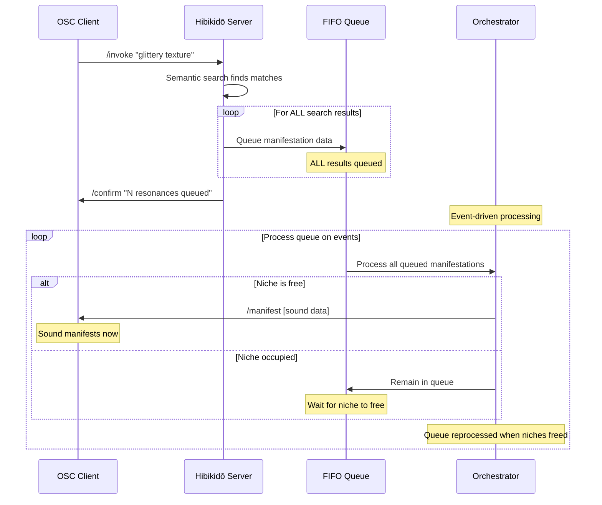

# Hibikidō Technical Guide

Complete technical reference for the semantic audio search system with real-time orchestration.

## System Architecture

Hibikidō implements neural semantic search over a hierarchical audio database with real-time Bark band niche management using perceptual audio analysis. The core loop: natural language → embedding vector → similarity search → queue all results → orchestrator evaluation → OSC manifestation when conditions allow.



### Communication Flow

The orchestrator manages time-frequency niches transparently. OSC clients receive `/manifest` messages when sounds find their moment.



### Component Architecture


## OSC Protocol

### Core Commands

Send to the server (default: `127.0.0.1:9000`):

```
/invoke "your description here"
→ Multiple /manifest messages as sounds become available (no completion signal)

/add_recording "forest_01.wav" "morning wind through oak trees"
→ Comprehensive audio analysis: 40+ features + Bark bands + 3-band onset detection
→ Auto-creates full-length segment (0.0-1.0) with complete feature set

/add_segment "forest_01.wav" "wind gusts" "start" 0.1 "end" 0.6
→ Create segment with full feature analysis for the specified time range

/generate_description "segment" 123
→ Generate Claude API description for segment ID 123 based on audio features

/generate_description "recording" 45 "force"
→ Force regenerate description for recording ID 45 (overwrite existing)

/add_effect "effects/reverb/cathedral.dll" '{"description":"gothic cathedral reverb"}'
→ Add new effect and auto-create default preset

/add_preset "warm cathedral ambience" '{"effect_path":"effects/reverb/cathedral.dll", "parameters":[0.8, 0.3, 0.9]}'
→ Add new effect preset with parameters

/rebuild_index
→ Regenerate all embeddings from database (use after bulk changes)

/stats
→ Database and orchestrator statistics

/list_segments
→ Show segment IDs and descriptions (first 10)

/get_segment_field 123 "features.spectral_entropy_mean"
→ Get specific field value from segment (supports nested field access)

/visualize 123
→ Show multi-band onset analysis visualization for segment ID (integer)

/stop
→ Graceful shutdown
```

### Response Messages

The server responds on `127.0.0.1:9001`:

**Sound Manifestations** (`/manifest`):

Each manifestation is sent as a separate message with 8 fields:

- `index`: Manifestation sequence (0, 1, 2...)
- `collection`: "segments" or "presets"
- `score`: Resonance strength (0.0-1.0, higher = stronger)
- `path`: File path for the audio/effect
- `description`: Human-readable description from embedding text
- `start`: Start position (0.0-1.0, normalized, 0.0 for presets)
- `end`: End position (0.0-1.0, normalized, 0.0 for presets)
- `parameters`: JSON string with metadata (segments include `{"segment_id": "123"}`, presets contain effect parameters)

**Status Messages**:

- `/confirm "message"` - Acknowledgments
- `/error "message"` - When operations fail
- `/stats_result [recordings, segments, effects, presets, embeddings, active_niches, queued]` - Database and orchestrator statistics
- `/segment_field [segment_id] [field_name] [value]` - Response to `/get_segment_field` requests

Note: Manifestations arrive over time as the orchestrator permits, following harmonic law rather than immediate demand.

## Data Architecture

### Database Schema

Hibikidō organizes sound through hierarchical relationships using TinyDB:

- **Recordings**: Source audio files with metadata
- **Segments**: Timestamped slices within recordings with Bark band spectral analysis, 3-band onset times, and duration metadata
- **Effects**: Audio processing tools with semantic presets  
- **Presets**: Effect configurations with parameters
- **Performances**: Session logs of invocations over time

Each segment and effect preset exists as a point in semantic space, findable through language that describes its essence rather than its filename.

### Portable Data Structure

```
hibikido-data/
├── database/                   # TinyDB JSON files
│   ├── recordings.json        # Audio file metadata
│   ├── segments.json          # Timestamped segments  
│   ├── effects.json           # Effect definitions
│   ├── presets.json           # Effect presets
│   ├── performances.json      # Session logs
│   └── segmentations.json     # Batch processing
├── index/                     # FAISS indices
│   └── hibikido.index         # Main semantic index
└── audio/                     # Audio files (optional)
```

**Key Benefits:**
- No database installation required (uses TinyDB)
- All data consolidated in one directory
- Easy backup/migration (copy hibikido-data/)
- Self-contained and portable

## Core Components

### orchestrator.py - Harmonic Management

The orchestrator manages Bark band niches, serving as guardian and mediator between human intention and harmonic law. Through perceptual Bark scale analysis and cosine similarity, it creates the harmonic spacing that prevents spectral conflicts while allowing maximum sonic richness.

**Core Concepts**:

- **Niches**: Active sound registrations with `{sound_id, start_time, end_time, bark_bands}`
- **Bark Band Analysis**: Uses 24 critical frequency bands (0Hz to ~15.5kHz) matching human auditory perception
- **Cosine Similarity**: Compares spectral energy distributions between sounds using normalized Bark vectors
- **FIFO Queue**: All search results await their turn in first-in-first-out order
- **Auto-Manifestation**: Background thread automatically manifests queued sounds when niches become available

**Key Methods**:

- `queue_manifestation(manifestation_data)`: Queue all search results
- `process_queue()`: Event-driven queue processing (called when niches change)
- `_find_conflict(bark_bands, now)`: Cosine similarity conflict detection using Bark bands
- `_process_queue()`: Main manifestation logic - sends `/manifest` when niches free

**Configuration**:

- `bark_similarity_threshold`: 0.5 (50% cosine similarity triggers conflict)

### main_server.py - Central Recognition

Central command implements the queue paradigm:

**Invocation Flow in `_handle_invoke()`**:

1. Perform semantic search
2. Filter to segments only (MVP requirement)
3. Queue all results through orchestrator
4. Send confirmation of queued resonances
5. Orchestrator sends `/manifest` messages when harmony allows

**Key Methods**:

- `_handle_invoke()`: queues all results
- Event-driven orchestration processes queue when manifestations are added or niches freed
- Stats include orchestrator metrics
- All manifestation sending delegated to orchestrator

### embedding_manager.py - Neural Recognition

Uses sentence-transformers for semantic search with FAISS index for vector similarity. Default model: all-MiniLM-L6-v2.

Orchestration happens after semantic search.

### audio_analyzer.py - Unified Analysis Orchestrator

The AudioAnalyzer coordinates all audio analysis components to provide comprehensive feature extraction.

**Components Integrated**:
- FeatureExtractor: 40+ spectral, temporal, and perceptual features
- BarkAnalyzer: 24 critical frequency bands for orchestration
- EnergyAnalyzer: 3-band onset detection for rhythmic analysis

**Key Methods**:
- `analyze_audio_data(y, sr, start_time, end_time)`: Complete analysis of loaded audio
- `analyze_file(audio_path, start_time, end_time)`: Load and analyze audio file
- Returns unified dictionary with all analysis results and comprehensive features

### feature_extractor.py - Comprehensive Audio Features

Extracts 40+ detailed audio characteristics for enhanced semantic search and AI description generation.

**Feature Categories**:

- **Basic Properties**: Duration, sample rate, RMS energy statistics
- **Spectral Features**: 
  - Spectral centroid/rolloff/bandwidth (brightness and timbre)
  - 13 MFCC coefficients (timbral texture)
  - Chroma features (harmonic content)
  - Spectral contrast (perceptual sharpness)
- **Temporal Features**:
  - Attack/decay times (envelope dynamics)
  - Sustained levels and dynamic range
  - Tempo and beat tracking
  - Onset rate (event density)
- **Harmonic Analysis**:
  - Harmonic/percussive separation ratios
  - Pitch salience (melodic vs textural)
- **Perceptual Qualities**:
  - Spectral entropy (chaos vs order)
  - Spectral irregularity (texture roughness)
  - Roughness coefficient (sensory dissonance)
- **Frequency Band Analysis**: Energy distribution across 8 perceptual bands (sub-bass to air)

**Usage Example**:
```python
from hibikido.feature_extractor import AudioFeatureExtractor

extractor = AudioFeatureExtractor()
features = extractor.extract_features("audio.wav", start_time=0.0, end_time=5.0)

# Access specific feature categories
print(f"Spectral centroid: {features['spectral_centroid_mean']} Hz")
print(f"Attack time: {features['attack_time']}s")
print(f"Pitch salience: {features['pitch_salience']}")
print(f"Dominant band: {features['dominant_frequency_band']}")
```

### semantic_analyzer.py - AI-Powered Descriptions

Integrates with Claude API to generate poetic, evocative descriptions from technical audio features.

**Core Features**:
- Converts 40+ audio features into natural language prompts
- Generates 15-20 word poetic descriptions
- Configurable via API key in config.json
- Cost-controlled on-demand generation

**Usage**:
```python
from hibikido.semantic_analyzer import SemanticAnalyzer

analyzer = SemanticAnalyzer("your-api-key")
description = analyzer.generate_description(features)
# Returns: "ethereal forest breathing with crystalline droplets dancing through misty morning silence"
```

### bark_analyzer.py - Perceptual Audio Analysis

The Bark analyzer extracts perceptually-accurate spectral fingerprints from audio files using the Bark scale, which models human auditory perception.

**Core Concepts**:

- **24 Critical Bands**: Covers 0Hz to ~15.5kHz using psychoacoustic Bark scale frequencies
- **Energy Normalization**: L2-normalized vectors enable cosine similarity comparison
- **Pre-computation**: Analysis during `/add_recording` ensures zero-latency orchestration
- **Duration Calculation**: Automatic audio file duration detection

**Key Methods**:

- `analyze_audio_file(path, start_time, end_time)`: Extract Bark bands and duration from audio segment
- `BarkAnalyzer.cosine_similarity(vector1, vector2)`: Compare spectral similarity (0.0-1.0)
- `BarkAnalyzer._compute_bark_bands(audio, sr)`: Internal 24-band energy extraction using librosa

**Usage Example**:

```python
from hibikido.bark_analyzer import analyze_audio_file, BarkAnalyzer

# Analyze full audio file
bark_bands, duration = analyze_audio_file("path/to/audio.wav")
print(f"Duration: {duration:.2f}s, Bark energy sum: {sum(bark_bands):.3f}")

# Analyze segment (normalized time 0.0-1.0)
bark_bands, duration = analyze_audio_file("path/to/audio.wav", 0.1, 0.6)

# Compare similarity between two sounds
similarity = BarkAnalyzer.cosine_similarity(bark_bands1, bark_bands2)
conflict = similarity > 0.5  # Using default threshold
```

### energy_analyzer.py - Multi-Band Onset Detection

The Energy Analyzer performs onset detection across 3 frequency bands to capture percussive transients and attacks in different spectral regions.

**Core Concepts**:

- **3 Frequency Bands**: 
  - Low-mid (150-2000 Hz): Low-frequency transients, impacts, rumbles, machinery
  - Mid (500-4000 Hz): Primary onset detection, human vocal range, central activity, most natural sounds
  - High-mid (2000-8000 Hz): High-frequency transients, clicks, metallic sounds, insects, electronic artifacts
- **IQR-Based Thresholding**: Adaptive onset detection using Interquartile Range per band
- **Onset Times Storage**: Arrays of precise onset timestamps for each frequency band
- **Robust Detection**: Handles varying signal dynamics (quiet passages, sirens, etc.)

**Key Methods**:

- `analyze_energy_data(y, sr, start_time, end_time)`: Extract onset times for 3 bands from audio segment
- Returns dictionary with `onset_times_low_mid`, `onset_times_mid`, `onset_times_high_mid`, and `duration`

**Usage Example**:

```python
from hibikido.energy_analyzer import analyze_energy_features
import librosa

# Load and analyze audio
y, sr = librosa.load("path/to/audio.wav", sr=32000)
results = analyze_energy_features(y, sr, start_time=0.0, end_time=10.0)

# Access onset times for each band
low_onsets = results['onset_times_low_mid']     # List of onset times in seconds
mid_onsets = results['onset_times_mid']         # List of onset times in seconds  
high_onsets = results['onset_times_high_mid']   # List of onset times in seconds

print(f"Low-mid band: {len(low_onsets)} onsets")
print(f"Mid band: {len(mid_onsets)} onsets") 
print(f"High-mid band: {len(high_onsets)} onsets")
```

### tinydb_manager.py - Hierarchical Storage

**Enhanced Database Schema**:

**Recordings**:
- `path`: Relative audio file path
- `description`: User or AI-generated description
- `features`: Complete 40+ audio feature dictionary
- `duration`: Sound duration (seconds)

**Segments**:
- `source_path`: Reference to parent recording
- `description`: User or AI-generated description  
- `features`: Complete 40+ audio feature dictionary for the segment
- `bark_bands_raw`: Array of 24 normalized energy values for Bark frequency bands (0.0-1.0)
- `bark_norm`: L2 norm of bark_bands_raw for cosine similarity
- `onset_times_low_mid`: Array of onset timestamps for 150-2000 Hz band (seconds)
- `onset_times_mid`: Array of onset timestamps for 500-4000 Hz band (seconds)
- `onset_times_high_mid`: Array of onset timestamps for 2000-8000 Hz band (seconds)
- `duration`: Segment duration (seconds)
- `FAISS_index`: Index into semantic embedding space
- `embedding_text`: Text used for semantic search

The comprehensive features enable advanced search capabilities, while Bark bands provide real-time orchestration.

## Batch Processing

For bulk import of audio collections, use the batch processor tool:

### tools/batch_processor.py

**Purpose**: Process directories of audio files and generate OSC commands for bulk import.

**Features**:
- Recursive audio file discovery (wav, mp3, flac, aiff, m4a, ogg, opus)
- Comprehensive feature extraction for all files
- Optional Claude API description generation
- Generates ready-to-send OSC commands
- Detailed error logging and progress tracking

**Usage**:

```bash
# Basic processing (filename-based descriptions)
python src/hibikido/tools/batch_processor.py /path/to/audio

# With Claude API descriptions
python src/hibikido/tools/batch_processor.py /path/to/audio \
  --api-key YOUR_CLAUDE_KEY --generate-descriptions

# Custom output directory
python src/hibikido/tools/batch_processor.py /path/to/audio \
  --output-dir /path/to/output
```

**Output Files**:
- `hibikido_batch_results.json`: Complete analysis results with features
- `hibikido_import_commands.osc`: Ready-to-send OSC commands
- `hibikido_failed_files.log`: Files that failed processing

**Integration Workflow**:
1. Run batch processor on audio directory
2. Copy audio files to `hibikido-data/audio/`  
3. Send OSC commands from generated .osc file to server
4. Use `/generate_description` commands for individual files as needed

This enables efficient bulk processing while maintaining cost control over AI description generation.

## Development Patterns

### Adding Bark Band Analysis to Existing Segments

Rebuild existing segments with Bark band analysis:

```python
# Re-analyze existing audio files for Bark bands
from hibikido.bark_analyzer import analyze_audio_file
from tinydb import TinyDB, Query

db = TinyDB('hibikido-data/database/segments.json')
Segment = Query()

# Find segments without Bark bands
segments_to_update = db.search(~Segment.bark_bands.exists())

for segment in segments_to_update:
    audio_path = f"../hibikido-data/audio/{segment['source_path']}"
    bark_bands, duration = analyze_audio_file(audio_path, 
                                             segment['start'], 
                                             segment['end'])
    
    db.update({
        'bark_bands': bark_bands,
        'duration': duration
    }, Segment.doc_id == segment.doc_id)
```

### Configuring Bark Band Orchestration

Modify orchestrator settings in `config.json`:

```json
{
  "orchestrator": {
    "bark_similarity_threshold": 0.3,  // 30% similarity threshold (more permissive)
    "time_precision": 0.05             // 50ms manifestation cycle
  },
  "audio": {
    "audio_directory": "../hibikido-data/audio"  // Path for relative audio files
  }
}
```

**Similarity Threshold Guidelines**:
- `0.3`: Very permissive - allows similar sounds to coexist
- `0.5`: Balanced - good separation for most use cases (default)
- `0.7`: Strict - only very different sounds can play simultaneously
- `0.9`: Ultra-strict - maximum spectral separation

### Debugging Orchestration

**Monitor Bark band niche management**:

```bash
# Enable orchestrator debug logging
python -m hibikido.main_server --log-level DEBUG

# Watch for these log messages:
# "Queued manifestation: sound_id [Bark bands sum: X.XXX]"
# "Manifested: sound_id [Bark sum: X.XXX] (queued for Xs)"
# "Queue has N items remaining"
```

**Check orchestrator state via OSC**:

```bash
# Send stats request to see active niches and queue
echo "/stats" | oscsend localhost 9000
```

## Configuration

Override defaults with `config.json`:

```json
{
  "database": {
    "data_dir": "../hibikido-data/database"
  },
  "embedding": {
    "model_name": "all-MiniLM-L6-v2",
    "index_file": "../hibikido-data/index/hibikido.index"
  },
  "osc": {
    "listen_ip": "127.0.0.1",
    "listen_port": 9000,
    "send_ip": "127.0.0.1",
    "send_port": 9001
  },
  "search": {
    "top_k": 10,
    "min_score": 0.3
  },
  "orchestrator": {
    "bark_similarity_threshold": 0.5,
    "time_precision": 0.1
  },
  "audio": {
    "audio_directory": "../hibikido-data/audio"
  }
}
```

## Performance Characteristics

- **Queue Latency**: ~0.1-1ms per manifestation queued
- **Manifestation Latency**: Near-instant when no conflicts, queued until niches free
- **Memory Overhead**: ~100 bytes per queued manifestation
- **Queue Processing**: All available manifestations processed per event
- **Bark Band Analysis**: Pre-computed 24-band spectral analysis for zero-latency orchestration
- **Cosine Similarity**: Optimized vector comparison using normalized Bark bands
- **Event-Driven Processing**: Immediate response to queue changes and niche availability

**Orchestration Scalability**: Tested with 50+ simultaneous manifestations and complex spectral overlaps using Bark band similarity detection.

## Installation & Setup

### Dependencies

```bash
pip install sentence-transformers python-osc faiss-cpu torch tinydb librosa soundfile

# For development with audio analysis:
pip install -e ".[dev,audio]"

# Optional enhanced text processing:
pip install spacy
python -m spacy download en_core_web_sm
```

### Launch Sequence

```bash
python -m hibikido.main_server [--config config.json] [--log-level DEBUG]
```

The server will:

1. Connect to TinyDB and initialize collections
2. Load the sentence transformer model
3. Initialize or load the FAISS index
4. Initialize orchestrator with time-frequency niche management
5. Start background thread for manifestation cycles
6. Start OSC server and register handlers
7. Send ready signal via OSC (`/confirm "hibikido_server_ready"`)

## Debugging

**Enable verbose logging**:

```bash
python -m hibikido.main_server --log-level DEBUG
```

**Inspect Bark band orchestration**: Check console logs for orchestrator decisions:

```
DEBUG:hibikido.orchestrator:Queued manifestation: segment_123 [Bark bands sum: 2.186]
DEBUG:hibikido.orchestrator:Manifested: segment_123 [Bark sum: 2.186] (queued for 0.2s)
DEBUG:hibikido.orchestrator:Queue has 3 items remaining
```

**Monitor niche state**: Use `/stats` OSC command to see active niches and queue length.

**Test invocation flow**: Send `/invoke "your description"` and watch manifestations emerge over time.